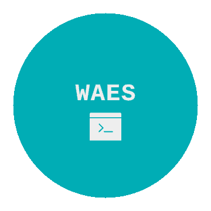

## To install:

1. $> git clone https://github.com/Shiva108/WAES.git
2. $> sudo ./install.sh

Make sure directories are set correctly in supergobuster.sh.
Should be automatic with Kali & Parrot Linux.
* Standard directories for lists    : SecLists/Discovery/Web-Content & SecLists/Discovery/Web-Content/CMS
* Kali / Parrot directory list      : /usr/share/wordlists/dirbuster/

## To run WAES
Web Auto Enum &amp; Scanner - Auto enums website(s) and dumps files as result.

##############################################################################

        Web Auto Enum & Scanner

        Auto enums website(s) and dumps files as result

##############################################################################

Usage: waes.sh -u {url}
       waes.sh -h

       -h shows this help
       -u url to test without http or https e.g. google.com

### Enumeration process / method

WAES runs ..

+ whatweb
+ OSIRA (same author)
+ nmap
  - standard scripts (-sC)
  - http-enum
  - vulners.nse
+ nikto
+ uniscan
+ super gobuster
  - gobuster with multiple lists
  - dirb with multiple lists

.. against target while dumping results files in report/ folder.

### To Do
+ Simplify tools check
+ Adding FD tools: https://github.com/chrispetrou/FDsploit
